# Annex A — Use Case Diagrams

> **Render note:** use-case diagrams are native **PlantUML** — each diagram is a
> `plantuml` source block (source of truth, editable) plus a committed SVG
> (`svg/*.svg`, rendered via the PlantUML server) embedded as a markdown image, so it
> renders in GitHub / VS Code / `file://`. Reason: Mermaid has no `useCaseDiagram`
> type (mermaid-js/mermaid#4628; rubric v1.9 §5C.5). Mermaid remains in use for
> sequence diagrams.
> Syntax follows the former reference: Case_02 `Doc21_Use_Cases_Catalog.md` §5.1.

**Source of truth:** `03_PHASE3_DECOMPOSITION/Doc22_Use_Cases_Catalog.md` §4 (product functional use cases, formerly §6B; UC-03..33 plus PKG-DS). Actors are taken from each fully-dressed card (primary actor per §4.x table; supporting actors from "Actor Brief Descriptions" §2.x). Include (`..>`) / extend (`.>`) edges are drawn **only** where a card's `**Constrained by:**` field or extensions explicitly indicate a dependency between two use cases **of the same package**; cross-package constraints are intentionally omitted here and remain traceable in Doc22/Doc23. Note: UC-66 and UC-92 (now UC-06 and UC-32 after the 2026-09-05 RENUMBER, rubric v1.10 §5B rule 7) were re-adjudicated from PROC-39/40 to the UC lane per rubric v1.8 §5B rule 6 (human decision 2026-09-05); they are genuine actor→system use cases shown as PKG-C/PKG-F members per Doc22 §4.2 and §4.7 tables. Diagrams carry UC ovals only (§5C.5): PROC-*/CAP-* live in the Doc32 lane cards.

---

## §1 — System-wide

Seven product packages (PKG-A..F + PKG-DS) and the top actors from Doc22 §4.1 (formerly §6B.0).

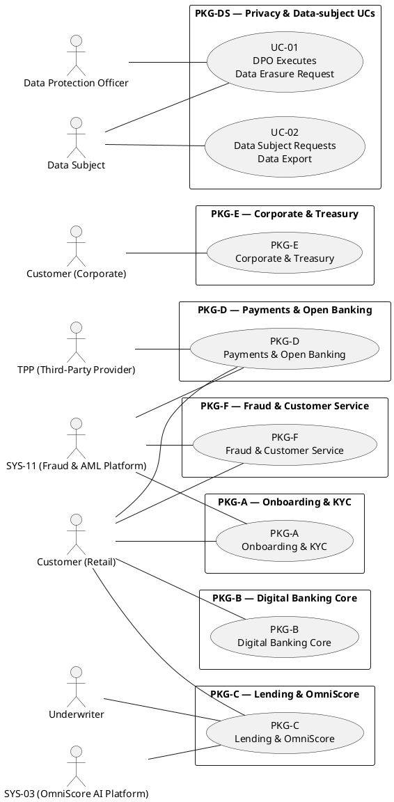

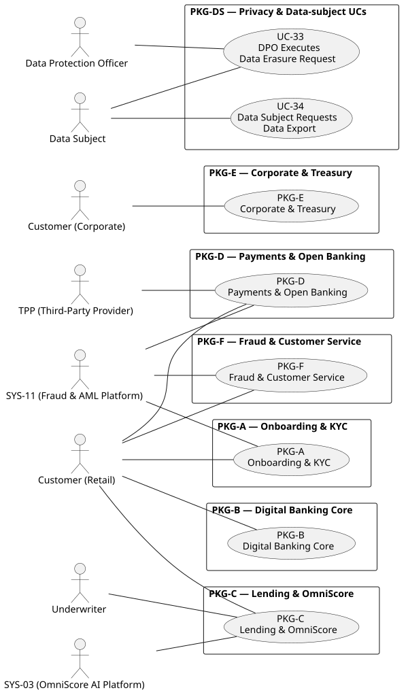

---

## §2 — PKG-A: Onboarding & KYC (UC-09..14)

Actors from cards UC-09..14. Includes: UC-09 brief description enumerates UC-10/11/12/13 as in-line steps; UC-14 `**Constrained by:**` UC-11 (vault filing).

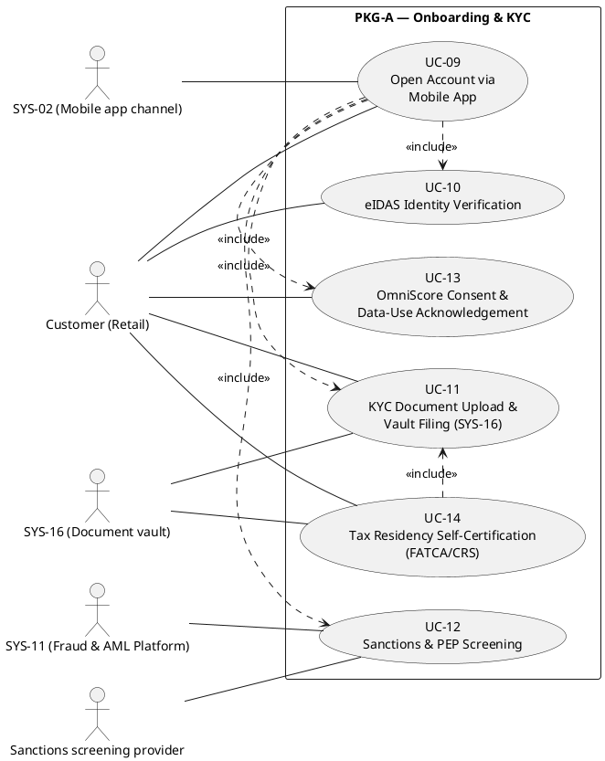

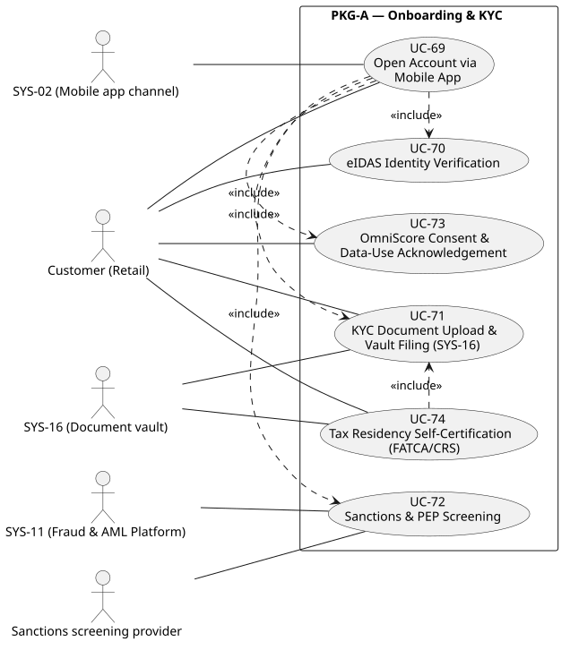

---

## §3 — PKG-B: Digital Banking Core (UC-15..20)

Actors from cards UC-15..20. Includes per `**Constrained by:**`: UC-16→UC-15, UC-17→UC-15, UC-18→UC-15/UC-17, UC-19→UC-17, UC-20→UC-15 (cross-package UC-25/UC-30/UC-02 constraints omitted).

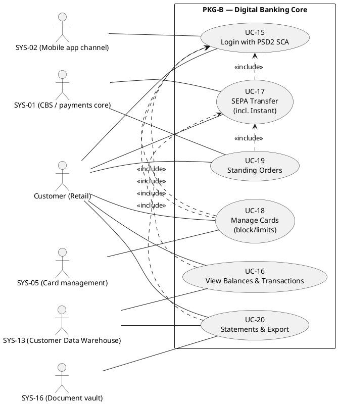

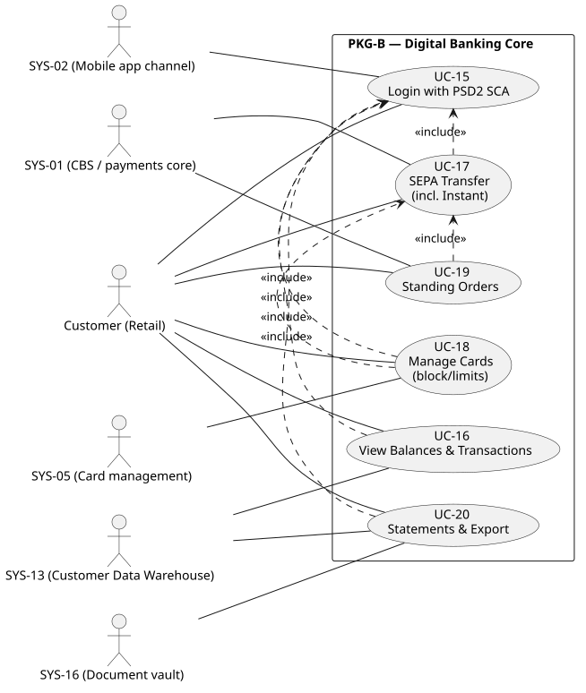

---

## §4 — PKG-C: Lending & OmniScore (UC-03..08)

Actors from cards UC-03/04/05/06/07/08. Edges: UC-05 `**Constrained by:**` UC-03 (consent record) → include; UC-06 (re-adjudicated from PROC-39) is the manual/borderline path of UC-03 per UC-03 brief description → extend.

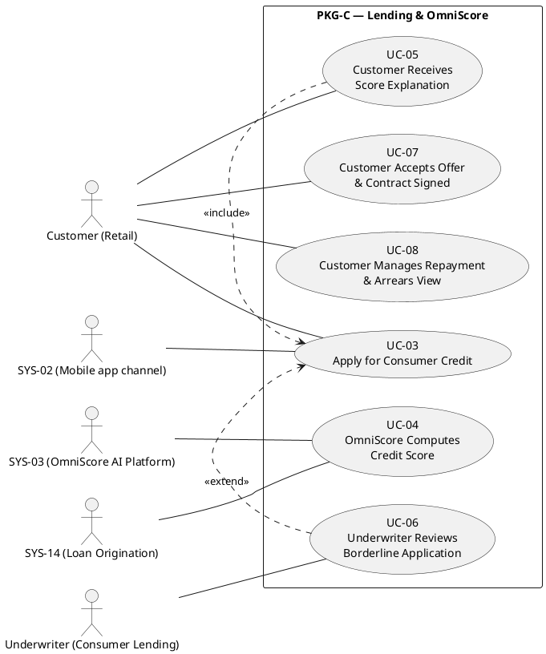

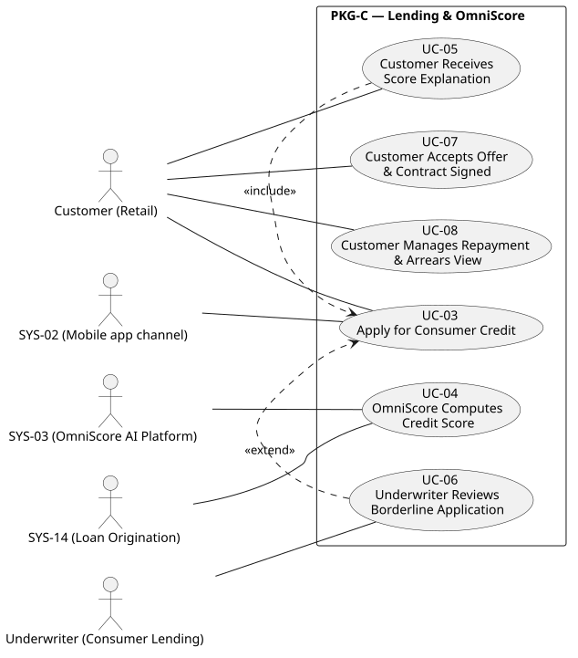

---

## §5 — PKG-D: Payments & Open Banking (UC-21..25)

Actors from cards UC-21..25. Includes per `**Constrained by:**`: UC-21↔UC-22 (mutual constraint recorded on both cards), UC-23→UC-21/UC-22, UC-25→UC-23 (cross-package UC-15/UC-17/CAP-10 omitted).

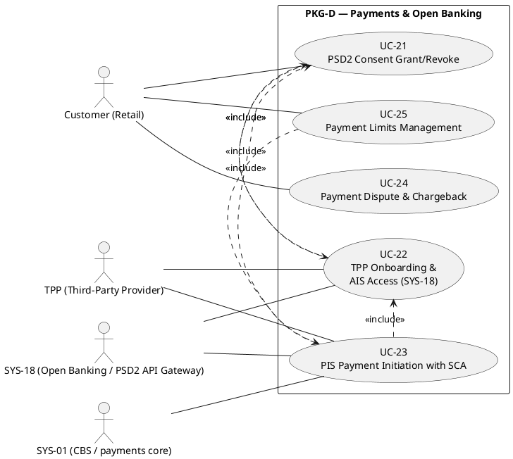

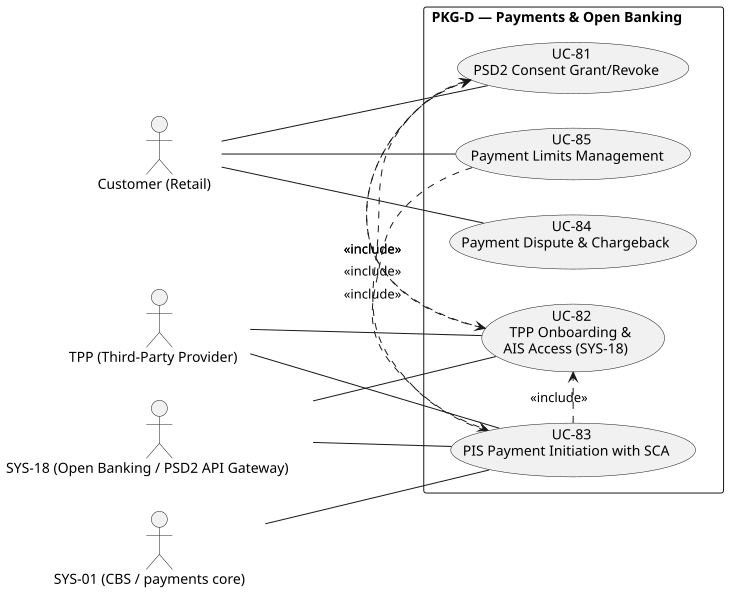

---

## §6 — PKG-E: Corporate & Treasury (UC-26..29)

Actors from cards UC-26..29 (Customer (Corporate) personas per card). Includes per `**Constrained by:**`: UC-27/UC-28/UC-29 → UC-26 (delegation scope / delegated authority / corporate authority; cross-package UC-12/UC-15 omitted).

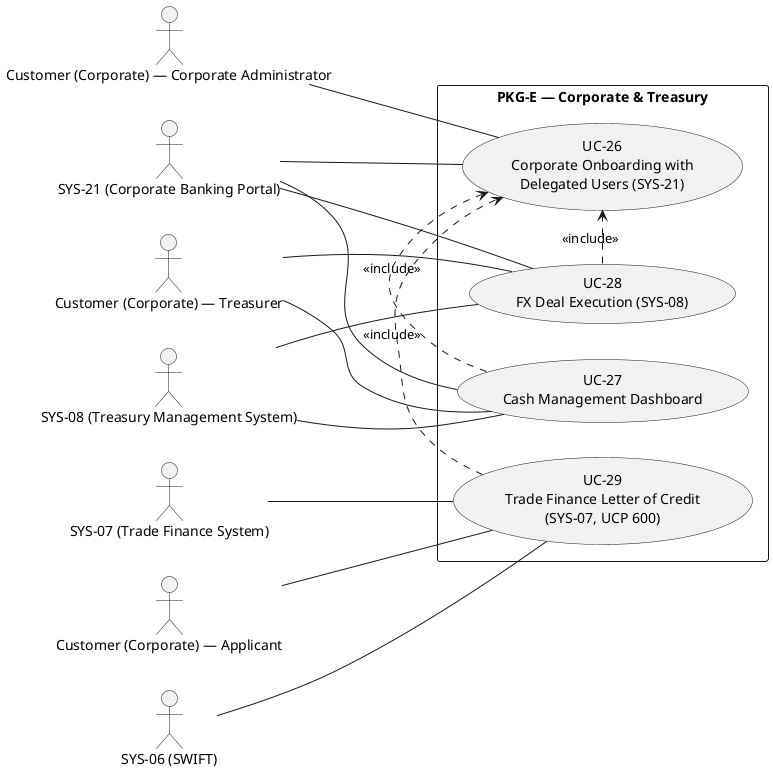

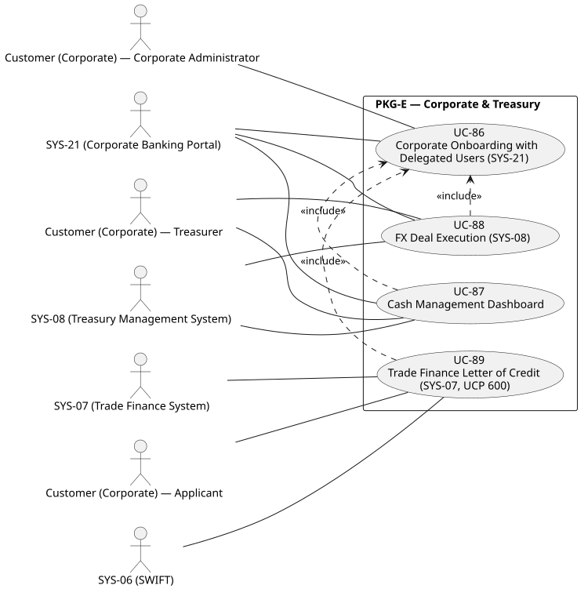

---

## §7 — PKG-F: Fraud & Customer Service (UC-30, UC-31, UC-32, UC-33)

Actors from cards UC-30/31/32/33 (UC-32 re-adjudicated from PROC-40 per rubric v1.8 §5B rule 6). Extend: UC-31 `**Constrained by:**` UC-30 (alert-loop fallback) — contact-centre block as fallback of the in-app alert loop. No same-package includes (all other constraints are cross-package).

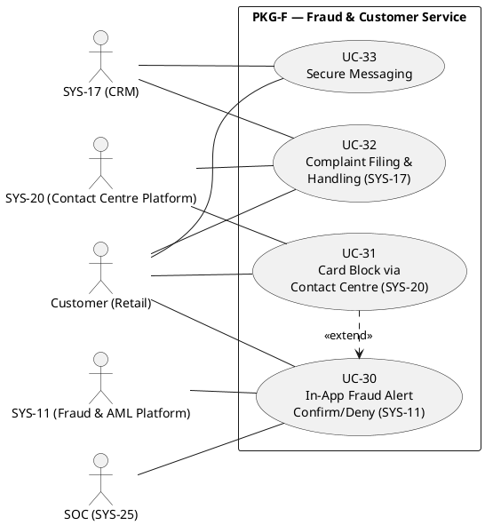

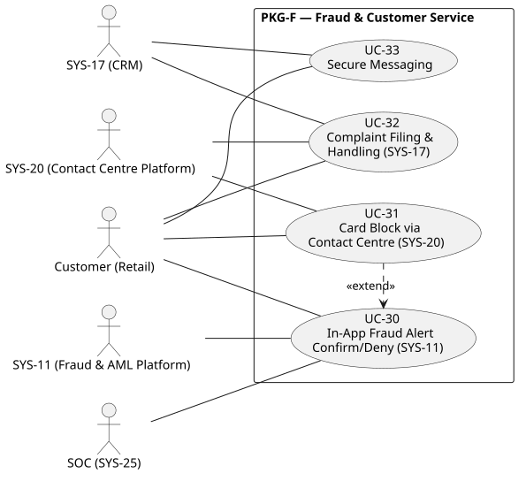
---

## §8 — PKG-DS: Privacy & Data-subject UCs (UC-01, UC-02)

New package in Doc22 v3.0 (UC SEPARATION): UC-33/UC-34 elevated to fully-dressed form (§4.8).
Actors from the cards: Data Protection Officer (primary on UC-01, secondary on UC-02), Data
Subject (requester; primary on UC-02). No same-package includes/extends (the erasure/export
constraints — PROC-21/PROC-23/CAP-10 and UC-03/UC-05/PROC-22 — are compliance-plane or
cross-package and stay traceable in Doc22 §4.8 §10 / §3.2).

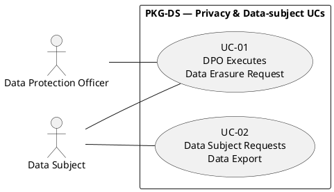

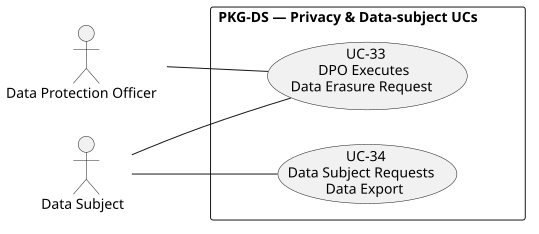

---

> **v1.2 (RENUMBER, 2026-09-05, rubric v1.10 §5B rule 7):** UC ovals renumbered UC-01..33; aliases kept; all 8 SVGs re-rendered from the updated sources.

**Traceability:** UC IDs ↔ Doc22 §4 fully-dressed cards; actor names ↔ §4.1 product actor table and per-card §2 "Actor Brief Descriptions"; include/extend edges ↔ per-card §10 `**Constrained by:**` fields (same-package subset only). Cross-package and compliance-plane dependencies (PROC-43, PROC-45, PROC-49, CAP-10, PROC-50, PROC-41, CAP-08, PROC-39/40, PROC-01..24, CAP-02) are documented in Doc22 §3.2/§4 §10 and Doc23_Use_Case_Relationships.md. UC-01/UC-02 are catalog UCs (PKG-DS, §8 above).
