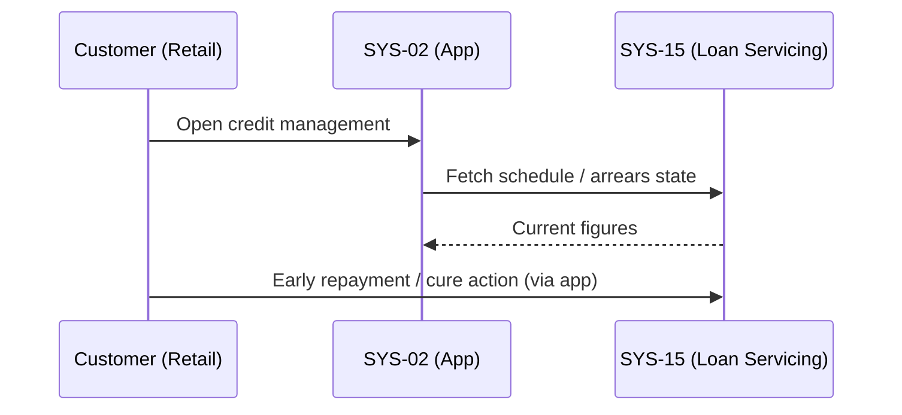
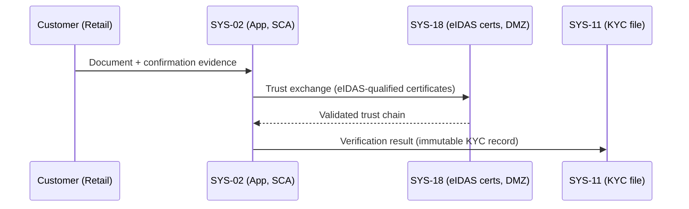
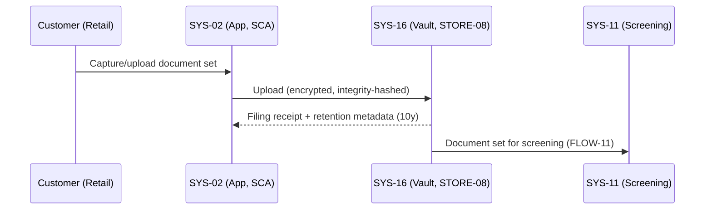
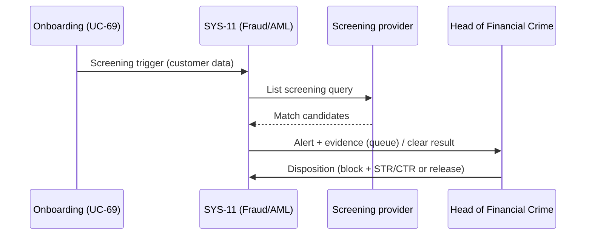
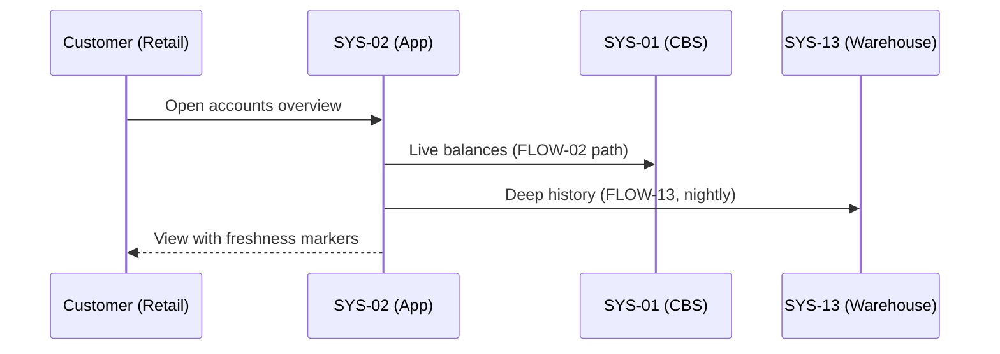
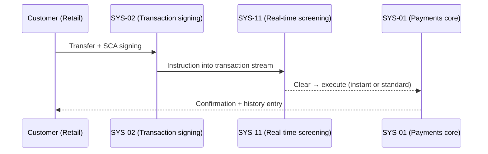
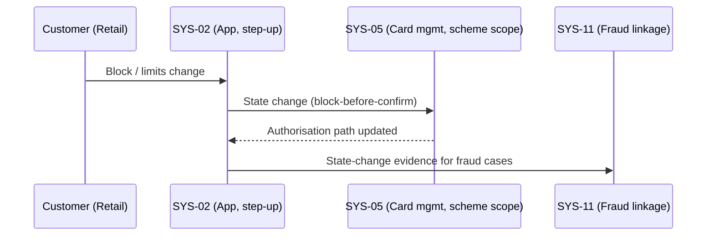
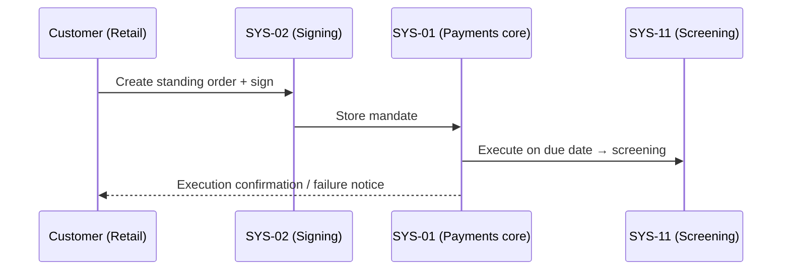
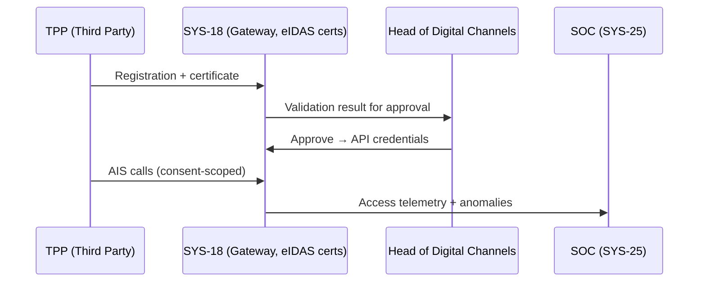

# Annex B — Sequence Diagrams

**Case:** OmniBank Financial Systems
**Phase:** 3 — Decomposition
**Status:** PLACEHOLDER

---

## B.1 Critical Path Sequences

This annex contains sequence diagrams for critical system interactions.

### Diagrams to be added:
- Authentication and authorization flow
- Financial transaction processing
- AI credit decision workflow
- Regulatory reporting sequence

**Status:** Awaiting generation from use case specifications

## §1 — Use-Case — {UC-63} Apply for Consumer Credit

```mermaid
sequenceDiagram
    participant C as Customer (Retail)
    participant APP as SYS-02 (App, SCA)
    participant LO as SYS-14 (Loan Origination)
    participant F as SYS-11 (Fraud/AML)
    C->>APP: Select product/amount/term; SECCI; consent + declarations
    APP->>LO: Submit application record
    LO->>F: Fraud screening
    LO->>LO: Invoke OmniScore decisioning (UC-64)
```

## §2 — Use-Case — {UC-64} OmniScore Computes Credit Score

```mermaid
sequenceDiagram
    participant LO as SYS-14 (Loan Origination)
    participant AI as SYS-03 (OmniScore)
    participant UW as Underwriter (PROC-39)
    LO->>AI: Decisioning request (application features)
    AI->>AI: Run approved model version; score + confidence band
    AI->>AI: Generate reason codes; write decision-context record
    AI-->>LO: Score + reasons + model version id
    LO->>UW: Borderline band -> queue human review
```

## §3 — Use-Case — {UC-65} Customer Receives Score Explanation

```mermaid
sequenceDiagram
    participant C as Customer (Retail)
    participant APP as SYS-02 (App)
    participant AI as SYS-03 (Explainability layer)
    C->>APP: Open decision screen
    APP->>AI: Request outcome view / explanation package
    AI-->>APP: Principal reason codes / package (CR-D-05.4-001 format)
    APP-->>C: Plain-language outcome; dispatch logged
```

## §4 — Use-Case — {PROC-39} Underwriter Reviews Borderline Application

```mermaid
sequenceDiagram
    participant UW as Underwriter
    participant LO as SYS-14 (Work item)
    participant GOV as Head of AI Governance
    LO->>UW: Work item (application, score, reasons, model version)
    UW->>UW: Independent review; overrides only with justification
    UW->>LO: Decision (approve/decline) + reason code
    LO-->>GOV: Override-vs-score delta for metrics
```

## §5 — Use-Case — {UC-67} Customer Accepts Offer & Contract Signed

```mermaid
sequenceDiagram
    participant C as Customer (Retail)
    participant LO as SYS-14 (Origination)
    participant KV as SYS-16 (KYC vault)
    participant AML as SYS-11 (AML)
    C->>LO: Accept offer; sign (PSD2 SCA, hardware-backed)
    LO->>KV: File contract (10-year retention)
    LO->>AML: New credit exposure tagged
    LO-->>C: Disbursement initiated
```

## §6 — Use-Case — {UC-68} Customer Manages Repayment & Arrears View



## §7 — Use-Case — {UC-69} Open Account via Mobile App

```mermaid
sequenceDiagram
    participant C as Customer (Retail)
    participant APP as SYS-02 (App, SCA)
    participant CRM as SYS-17 (Customer 360)
    participant F as SYS-11 (KYC/AML)
    C->>APP: Start onboarding; data + product selection
    APP->>CRM: Create onboarding/customer record
    APP->>F: Identity + document + screening steps (UC-70..72)
    F-->>CRM: Screening result anchored to record
    CRM-->>C: Account activated; SCA credentials issued
```

## §8 — Use-Case — {UC-70} eIDAS Identity Verification



## §9 — Use-Case — {UC-71} KYC Document Upload & Vault Filing (SYS-16, 10y retention)



## §10 — Use-Case — {UC-72} Sanctions & PEP Screening



## §11 — Use-Case — {UC-73} OmniScore Consent & Data-Use Acknowledgement


## §12 — Use-Case — {UC-74} Tax Residency Self-Certification (FATCA/CRS)

```mermaid
sequenceDiagram
    participant C as Customer (Retail)
    participant APP as SYS-02 (App)
    participant DMS as SYS-16 (Vault)
    participant CO as Head of Compliance Ops
    APP->>C: Self-certification form
    C->>APP: Declare residency + TINs; sign
    APP->>DMS: File certification with KYC record
    CO->>DMS: Re-certification tasks on change events
```

## §13 — Use-Case — {UC-75} Login with PSD2 SCA

```mermaid
sequenceDiagram
    participant C as Customer (Retail)
    participant APP as SYS-02 (SCA, hardware-backed)
    participant ID as SYS-24 (Identity service)
    participant F as SYS-11 (Behavioural signals)
    C->>APP: Credentials + SCA factor
    APP->>ID: Session validation
    ID-->>APP: Valid; risk-based step-up decision
    APP->>F: Behavioural signal check
    APP-->>C: SCA session established (device-bound)
```

## §14 — Use-Case — {UC-76} View Balances & Transactions



## §15 — Use-Case — {UC-77} SEPA Transfer (incl. Instant)



## §16 — Use-Case — {UC-78} Manage Cards (block/limits)



## §17 — Use-Case — {UC-79} Standing Orders



## §18 — Use-Case — {UC-80} Statements & Export

```mermaid
sequenceDiagram
    participant C as Customer (Retail)
    participant APP as SYS-02 (App, SCA)
    participant CDW as SYS-13 (Warehouse)
    participant DMS as SYS-16 (Vault)
    C->>APP: Statement/export request
    APP->>CDW: Generate (FLOW-13 history / live core)
    CDW-->>APP: Document + CR-D-05.4-001 export format
    APP->>DMS: Periodic statement archived; download logged
```

## §19 — Use-Case — {UC-81} PSD2 Consent Grant/Revoke

```mermaid
sequenceDiagram
    participant TPP as TPP (Third Party)
    participant GW as SYS-18 (Consent mgmt, eIDAS certs)
    participant APP as SYS-02 (SCA)
    participant C as Customer (Retail)
    TPP->>GW: Consent request (scope, duration)
    GW->>APP: SCA ceremony + consent screen
    C->>APP: Grant (possibly narrowed scope)
    APP->>GW: Consent recorded; token to TPP
    C->>GW: Revoke anytime → access cut
```

## §20 — Use-Case — {UC-82} TPP Onboarding & AIS Access (SYS-18)



## §21 — Use-Case — {UC-83} PIS Payment Initiation with SCA

```mermaid
sequenceDiagram
    participant TPP as TPP (Third Party)
    participant GW as SYS-18 (Gateway)
    participant APP as SYS-02 (SCA)
    participant CBS as SYS-01 (Payments core)
    TPP->>GW: Payment initiation (consent + cert validated)
    GW->>APP: SCA challenge (redirect/decoupled)
    APP-->>GW: SCA approval
    GW->>CBS: Commit (screened via FLOW-10)
    GW-->>TPP: Status callback
```

## §22 — Use-Case — {UC-84} Payment Dispute & Chargeback

```mermaid
sequenceDiagram
    participant C as Customer (Retail)
    participant CRM as SYS-17 (Case)
    participant CARDS as SYS-05 (Scheme path)
    participant F as SYS-11 (Fraud linkage)
    C->>CRM: Dispute + evidence (app or SYS-20)
    CRM->>CARDS: Chargeback assessment
    CARDS-->>CRM: Scheme outcome
    CRM->>F: Fraud linkage if suspected
    CRM-->>C: Outcome communicated
```

## §23 — Use-Case — {UC-85} Payment Limits Management

```mermaid
sequenceDiagram
    participant C as Customer (Retail)
    participant APP as SYS-02 (Step-up)
    participant CBS as SYS-01 (Enforcement)
    participant F as SYS-11 (Risk rules)
    C->>APP: Limit change request
    APP->>F: Risk validation (thresholds)
    F-->>APP: Approve / human-review path
    APP->>CBS: Effective change + immutable log
```

## §24 — Use-Case — {UC-86} Corporate Onboarding with Delegated Users (SYS-21)

```mermaid
sequenceDiagram
    participant CA as Corp Administrator
    participant PORTAL as SYS-21 (Corporate portal)
    participant F as SYS-11 (Entity/UBO screening)
    participant CO as Head of Corporate Banking
    CA->>PORTAL: Entity data + UBO structure
    PORTAL->>F: Screening (entity + UBOs)
    F-->>PORTAL: Clear / hit
    PORTAL->>CO: KYB complete → activation approval
    PORTAL->>CA: Delegated users + roles provisioned (SoD validated)
```

## §25 — Use-Case — {UC-87} Cash Management Dashboard

```mermaid
sequenceDiagram
    participant T as Treasurer (Corporate)
    participant PORTAL as SYS-21 (Cash mgmt)
    participant CBS as SYS-01 (Accounts)
    participant TMS as SYS-08 (Positions)
    T->>PORTAL: Open dashboard
    PORTAL->>CBS: Account balances
    PORTAL->>TMS: Position context
    PORTAL-->>T: Aggregated view (freshness-marked, scope-filtered)
```

## §26 — Use-Case — {UC-88} FX Deal Execution (SYS-08)

```mermaid
sequenceDiagram
    participant T as Treasurer (Corporate)
    participant PORTAL as SYS-21 (Corporate FX)
    participant TMS as SYS-08 (TMS)
    participant TO as Treasury Ops
    T->>PORTAL: Quote request (pair, amount, date)
    PORTAL->>TMS: Quote (validity window)
    T->>TMS: Accept in window (SCA)
    TMS->>TO: Booked deal + position update
```

## §27 — Use-Case — {UC-89} Trade Finance Letter of Credit (SYS-07, UCP 600)

```mermaid
sequenceDiagram
    participant AP as Applicant (Corporate)
    participant TF as SYS-07 (Trade Finance, UCP 600)
    participant SW as SYS-06 (SWIFT correspondents)
    participant BB as Beneficiary bank
    AP->>TF: LC issuance request
    TF->>TF: Review + sanctions screening (SYS-11)
    TF->>SW: Issue + advise (FLOW-24 secure channel)
    BB->>TF: Present documents
    TF->>AP: Examination outcome (pay / refuse per UCP 600)
```

## §28 — Use-Case — {UC-90} In-App Fraud Alert Confirm/Deny (SYS-11)

```mermaid
sequenceDiagram
    participant F as SYS-11 (Detection)
    participant APP as SYS-02 (Alert surface)
    participant C as Customer (Retail)
    participant SOC as SOC (SYS-25)
    F->>APP: Suspicious transaction flagged
    APP->>C: Fraud alert (context)
    C->>APP: Confirm / Deny
    APP->>F: Release / block + case
    F->>SOC: Escalation if unresolved
```

## §29 — Use-Case — {UC-91} Card Block via Contact Centre (SYS-20)

```mermaid
sequenceDiagram
    participant C as Customer (Retail)
    participant CC as SYS-20 (Agent, recorded call)
    participant CARDS as SYS-05 (Card mgmt)
    participant F as SYS-11 (Fraud case)
    C->>CC: Block request (phone)
    CC->>CC: Verification protocol
    CC->>CARDS: Block (temporary-first when in doubt)
    CARDS-->>CC: Authorisation path updated
    CC->>F: Case linkage if misuse suspected
```

## §30 — Use-Case — {PROC-40} Complaint Filing & Handling (SYS-17)

```mermaid
sequenceDiagram
    participant C as Customer (Retail)
    participant CRM as SYS-17 (Case mgmt)
    participant CC as SYS-20 (Phone intake)
    participant CO as Compliance Officer
    C->>CRM: Complaint + evidence (app)
    C->>CC: Alternative intake (recorded call)
    CC->>CRM: Case created
    CRM->>CRM: Investigation + SLA tracking
    CRM->>CO: Escalation (regulatory path) if needed
    CRM-->>C: Outcome + response
```

## §31 — Use-Case — {UC-93} Secure Messaging

```mermaid
sequenceDiagram
    participant C as Customer (Retail)
    participant APP as SYS-02 (App, SCA)
    participant CRM as SYS-17 (Agent inbox)
    participant DMS as SYS-16 (Vault)
    C->>APP: Message (+ attachment)
    APP->>CRM: Thread message
    APP->>DMS: Sensitive attachment → vault reference
    CRM-->>C: Agent reply + transcript retained
```

