# Annex B — Sequence Diagrams

**Case:** OmniBank Financial Systems
**Phase:** 3 — Decomposition
**Status:** ACTIVE — 33 sequences, one per Doc22 catalog use case, ordered by id (rubric v1.8 §5C.5).

> **v2.0 (UC SEPARATION, 2026-09-05):** sections re-ordered by id (UC-33, UC-34, then UC-63..UC-93);
> UC-66 and UC-92 restored in place (re-adjudicated from PROC-39/40, rubric v1.8 §5B rule 6);
> §1/§2 sequences added for the PKG-DS use cases (UC-33/UC-34, fully-dressed in Doc22 §4.8);
> empty "B.1 Critical Path Sequences" placeholder removed.
>
> **v2.1 (RENUMBER, 2026-09-05, rubric v1.10 §5B rule 7):** ids renumbered UC-01..33; §N order preserved (old→new mapping is ascending), Doc22 pointers remain 1:1.

> **2026-09-10:** Catalogue cards now embed derived copies of these diagrams inline; this annex remains the editable source (rubric §5C.5 v1.11).

## §1 — Use-Case — {UC-01} Data Protection Officer Executes Data Erasure Request

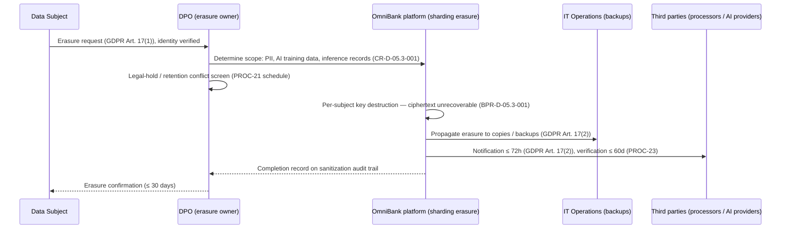

## §2 — Use-Case — {UC-02} Data Subject Requests Data Export

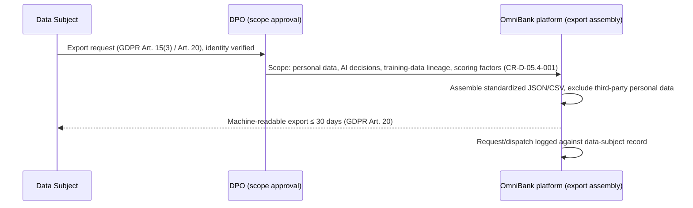

## §3 — Use-Case — {UC-03} Apply for Consumer Credit


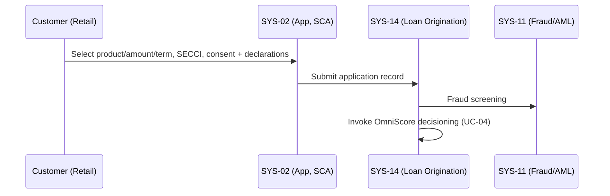

## §4 — Use-Case — {UC-04} OmniScore Computes Credit Score


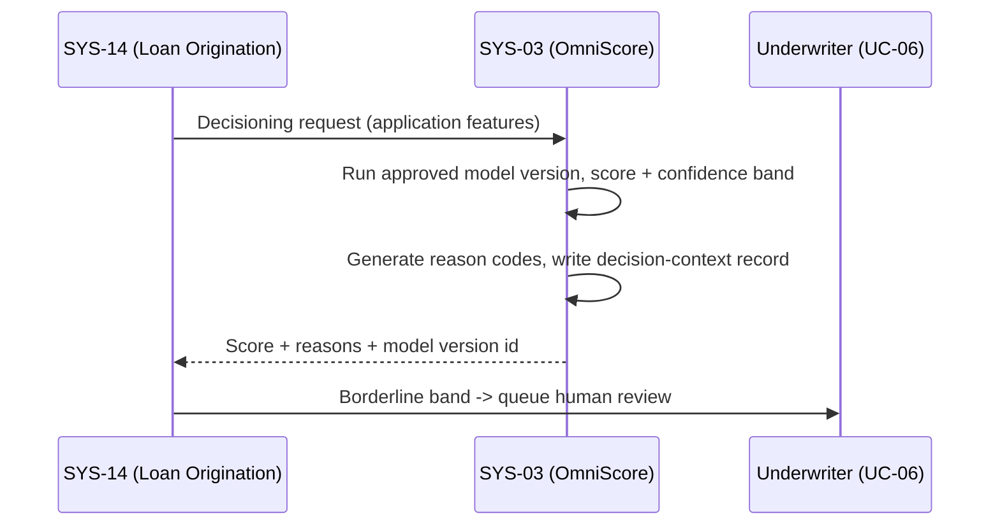

## §5 — Use-Case — {UC-05} Customer Receives Score Explanation


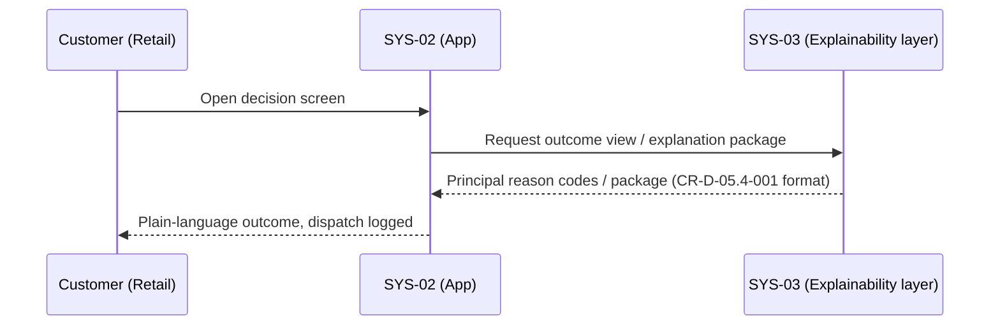

## §6 — Use-Case — {UC-06} Underwriter Reviews Borderline Application


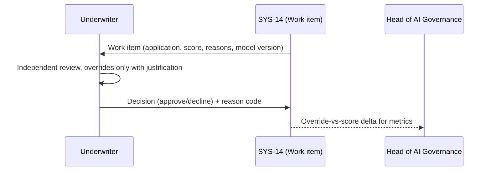

## §7 — Use-Case — {UC-07} Customer Accepts Offer & Contract Signed


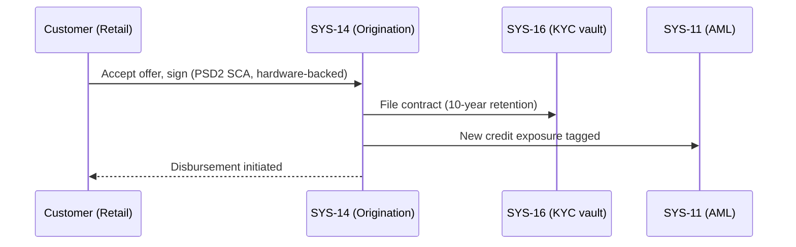

## §8 — Use-Case — {UC-08} Customer Manages Repayment & Arrears View


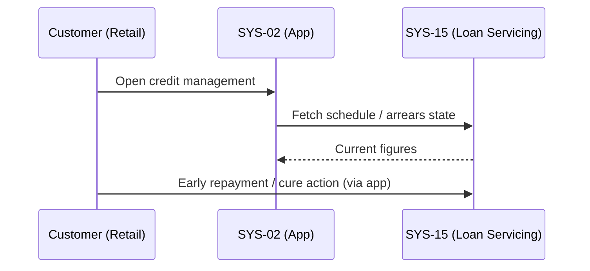

## §9 — Use-Case — {UC-09} Open Account via Mobile App


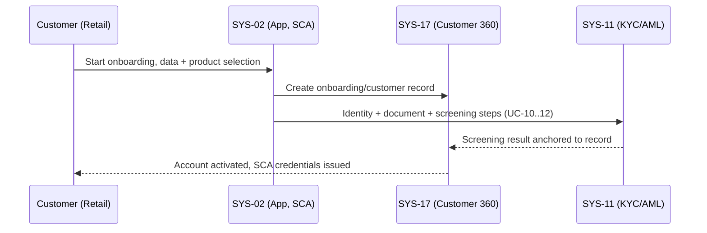

## §10 — Use-Case — {UC-10} eIDAS Identity Verification


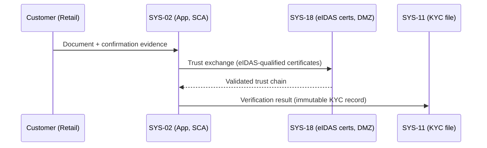

## §11 — Use-Case — {UC-11} KYC Document Upload & Vault Filing (SYS-16, 10y retention)


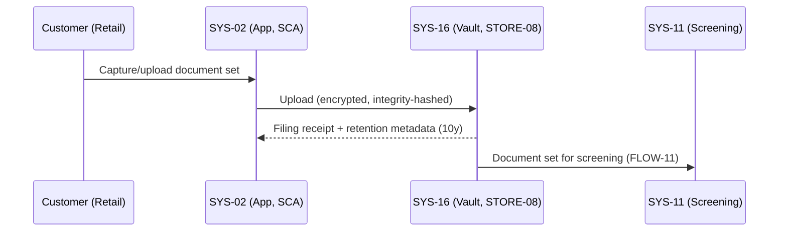

## §12 — Use-Case — {UC-12} Sanctions & PEP Screening


## §13 — Use-Case — {UC-13} OmniScore Consent & Data-Use Acknowledgement


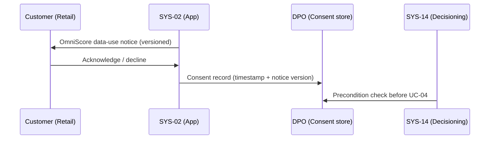

## §14 — Use-Case — {UC-14} Tax Residency Self-Certification (FATCA/CRS)


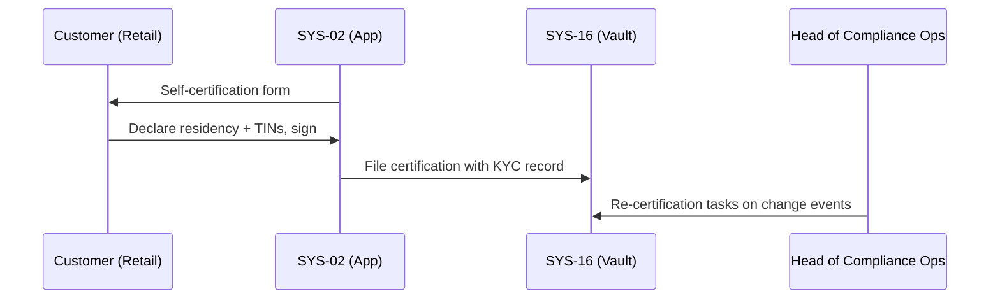

## §15 — Use-Case — {UC-15} Login with PSD2 SCA


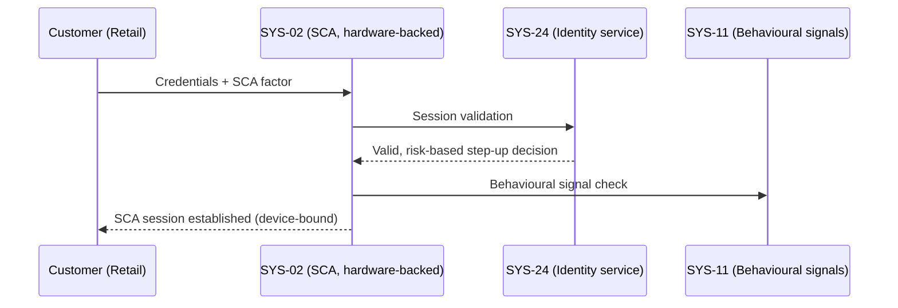

## §16 — Use-Case — {UC-16} View Balances & Transactions


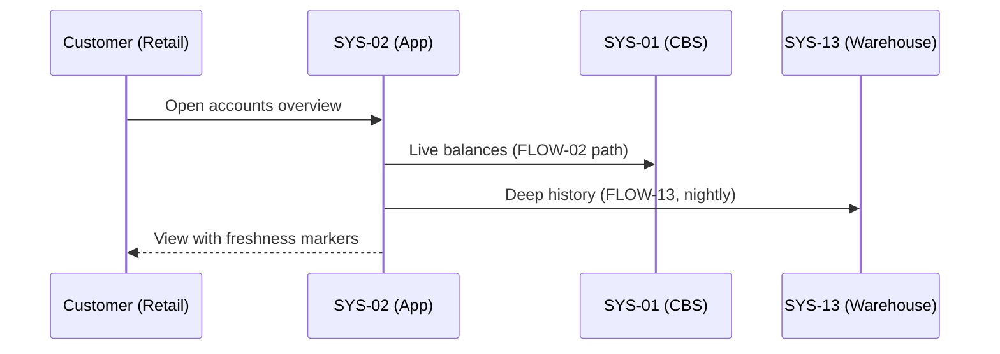

## §17 — Use-Case — {UC-17} SEPA Transfer (incl. Instant)


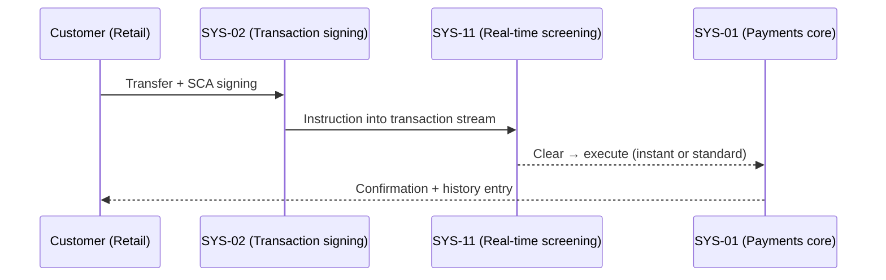

## §18 — Use-Case — {UC-18} Manage Cards (block/limits)


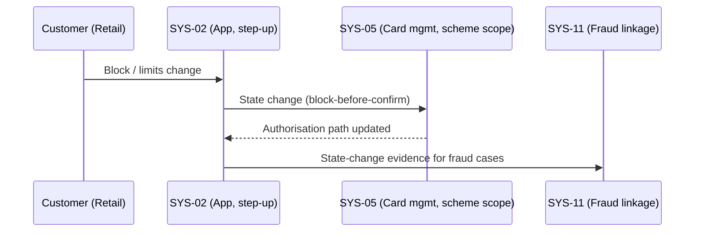

## §19 — Use-Case — {UC-19} Standing Orders


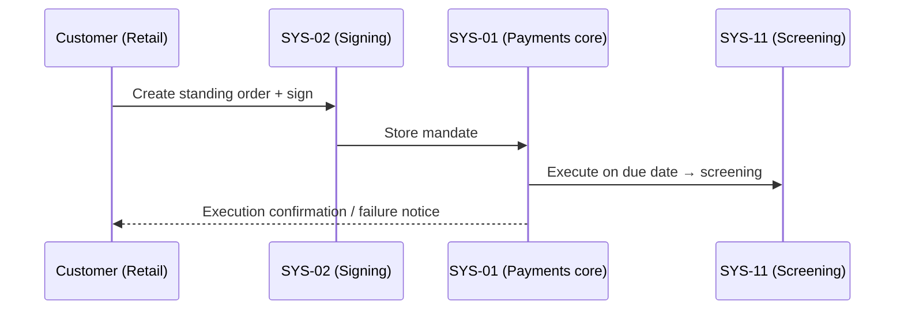

## §20 — Use-Case — {UC-20} Statements & Export


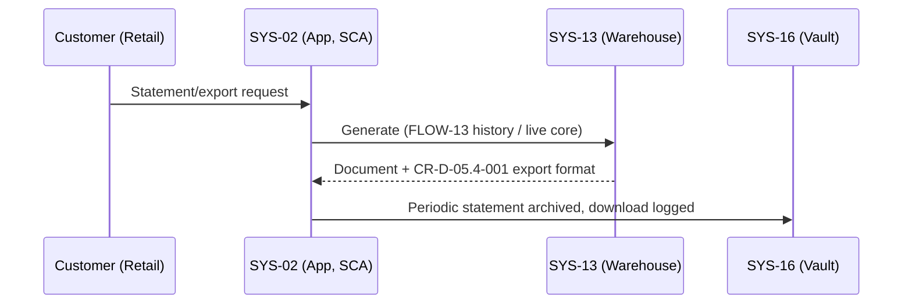

## §21 — Use-Case — {UC-21} PSD2 Consent Grant/Revoke


```mermaid
sequenceDiagram
    participant TPP as TPP (Third Party)
    participant GW as SYS-18 (Consent mgmt, eIDAS certs)
    participant APP as SYS-02 (SCA)
    participant C as Customer (Retail)
    TPP->>GW: Consent request (scope, duration)
    GW->>APP: SCA ceremony + consent screen
    C->>APP: Grant (possibly narrowed scope)
    APP->>GW: Consent recorded, token to TPP
    C->>GW: Revoke anytime → access cut
```

## §22 — Use-Case — {UC-22} TPP Onboarding & AIS Access (SYS-18)


```mermaid
sequenceDiagram
    participant TPP as TPP (Third Party)
    participant GW as SYS-18 (Gateway, eIDAS certs)
    participant DC as Head of Digital Channels
    participant SOC as SOC (SYS-25)
    TPP->>GW: Registration + certificate
    GW->>DC: Validation result for approval
    DC->>GW: Approve → API credentials
    TPP->>GW: AIS calls (consent-scoped)
    GW->>SOC: Access telemetry + anomalies
```

## §23 — Use-Case — {UC-23} PIS Payment Initiation with SCA


```mermaid
sequenceDiagram
    participant TPP as TPP (Third Party)
    participant GW as SYS-18 (Gateway)
    participant APP as SYS-02 (SCA)
    participant CBS as SYS-01 (Payments core)
    TPP->>GW: Payment initiation (consent + cert validated)
    GW->>APP: SCA challenge (redirect/decoupled)
    APP-->>GW: SCA approval
    GW->>CBS: Commit (screened via FLOW-10)
    GW-->>TPP: Status callback
```

## §24 — Use-Case — {UC-24} Payment Dispute & Chargeback


```mermaid
sequenceDiagram
    participant C as Customer (Retail)
    participant CRM as SYS-17 (Case)
    participant CARDS as SYS-05 (Scheme path)
    participant F as SYS-11 (Fraud linkage)
    C->>CRM: Dispute + evidence (app or SYS-20)
    CRM->>CARDS: Chargeback assessment
    CARDS-->>CRM: Scheme outcome
    CRM->>F: Fraud linkage if suspected
    CRM-->>C: Outcome communicated
```

## §25 — Use-Case — {UC-25} Payment Limits Management


```mermaid
sequenceDiagram
    participant C as Customer (Retail)
    participant APP as SYS-02 (Step-up)
    participant CBS as SYS-01 (Enforcement)
    participant F as SYS-11 (Risk rules)
    C->>APP: Limit change request
    APP->>F: Risk validation (thresholds)
    F-->>APP: Approve / human-review path
    APP->>CBS: Effective change + immutable log
```

## §26 — Use-Case — {UC-26} Corporate Onboarding with Delegated Users (SYS-21)


```mermaid
sequenceDiagram
    participant CA as Corp Administrator
    participant PORTAL as SYS-21 (Corporate portal)
    participant F as SYS-11 (Entity/UBO screening)
    participant CO as Head of Corporate Banking
    CA->>PORTAL: Entity data + UBO structure
    PORTAL->>F: Screening (entity + UBOs)
    F-->>PORTAL: Clear / hit
    PORTAL->>CO: KYB complete → activation approval
    PORTAL->>CA: Delegated users + roles provisioned (SoD validated)
```

## §27 — Use-Case — {UC-27} Cash Management Dashboard


```mermaid
sequenceDiagram
    participant T as Treasurer (Corporate)
    participant PORTAL as SYS-21 (Cash mgmt)
    participant CBS as SYS-01 (Accounts)
    participant TMS as SYS-08 (Positions)
    T->>PORTAL: Open dashboard
    PORTAL->>CBS: Account balances
    PORTAL->>TMS: Position context
    PORTAL-->>T: Aggregated view (freshness-marked, scope-filtered)
```

## §28 — Use-Case — {UC-28} FX Deal Execution (SYS-08)


```mermaid
sequenceDiagram
    participant T as Treasurer (Corporate)
    participant PORTAL as SYS-21 (Corporate FX)
    participant TMS as SYS-08 (TMS)
    participant TO as Treasury Ops
    T->>PORTAL: Quote request (pair, amount, date)
    PORTAL->>TMS: Quote (validity window)
    T->>TMS: Accept in window (SCA)
    TMS->>TO: Booked deal + position update
```

## §29 — Use-Case — {UC-29} Trade Finance Letter of Credit (SYS-07, UCP 600)


```mermaid
sequenceDiagram
    participant AP as Applicant (Corporate)
    participant TF as SYS-07 (Trade Finance, UCP 600)
    participant SW as SYS-06 (SWIFT correspondents)
    participant BB as Beneficiary bank
    AP->>TF: LC issuance request
    TF->>TF: Review + sanctions screening (SYS-11)
    TF->>SW: Issue + advise (FLOW-24 secure channel)
    BB->>TF: Present documents
    TF->>AP: Examination outcome (pay / refuse per UCP 600)
```

## §30 — Use-Case — {UC-30} In-App Fraud Alert Confirm/Deny (SYS-11)


```mermaid
sequenceDiagram
    participant F as SYS-11 (Detection)
    participant APP as SYS-02 (Alert surface)
    participant C as Customer (Retail)
    participant SOC as SOC (SYS-25)
    F->>APP: Suspicious transaction flagged
    APP->>C: Fraud alert (context)
    C->>APP: Confirm / Deny
    APP->>F: Release / block + case
    F->>SOC: Escalation if unresolved
```

## §31 — Use-Case — {UC-31} Card Block via Contact Centre (SYS-20)


```mermaid
sequenceDiagram
    participant C as Customer (Retail)
    participant CC as SYS-20 (Agent, recorded call)
    participant CARDS as SYS-05 (Card mgmt)
    participant F as SYS-11 (Fraud case)
    C->>CC: Block request (phone)
    CC->>CC: Verification protocol
    CC->>CARDS: Block (temporary-first when in doubt)
    CARDS-->>CC: Authorisation path updated
    CC->>F: Case linkage if misuse suspected
```

## §32 — Use-Case — {UC-32} Complaint Filing & Handling (SYS-17)


```mermaid
sequenceDiagram
    participant C as Customer (Retail)
    participant CRM as SYS-17 (Case mgmt)
    participant CC as SYS-20 (Phone intake)
    participant CO as Compliance Officer
    C->>CRM: Complaint + evidence (app)
    C->>CC: Alternative intake (recorded call)
    CC->>CRM: Case created
    CRM->>CRM: Investigation + SLA tracking
    CRM->>CO: Escalation (regulatory path) if needed
    CRM-->>C: Outcome + response
```

## §33 — Use-Case — {UC-33} Secure Messaging


```mermaid
sequenceDiagram
    participant C as Customer (Retail)
    participant APP as SYS-02 (App, SCA)
    participant CRM as SYS-17 (Agent inbox)
    participant DMS as SYS-16 (Vault)
    C->>APP: Message (+ attachment)
    APP->>CRM: Thread message
    APP->>DMS: Sensitive attachment → vault reference
    CRM-->>C: Agent reply + transcript retained
```
