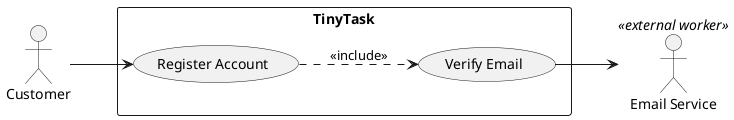

# Writing Use Cases (AEGIS)

A reference skill for **drafting and reviewing** UML use case diagrams and use
case specifications that meet both industry best practice (Cockburn, Fowler,
OMG UML 2.5.1, Machado/RMAC UM-2001) and AEGIS Phase 3 conventions
(`REALIZATION_CLASS_RUBRIC.md` §5B/§5C, the Bike4All RUP 10-section template).

The skill is **advisory, not generative** — it teaches the model what a good
artefact looks like so it can draft, review, and correct. It does not run code.

## When to Use

- Drafting a new `Doc20/Doc21/Doc22_Use_Cases_Catalog.md` card or revising one.
- Authoring or reviewing a use case **diagram** (annex A) — PlantUML + SVG.
- Authoring or reviewing a **sequence diagram** (annex B) — Mermaid.
- Triaging a UC that "feels wrong" (CRUD-named, no actor, UI-laden steps).
- Auditing an existing UC against the §10 Security & Compliance annex schema.
- Onboarding a new contributor who must learn the AEGIS UC conventions.

## When NOT to Use

- ID hierarchy / frontmatter / file naming → use the `doc-conventions` skill.
- Loading the case state chain → use the `case-context-loader` skill.
- Lane-naming adjudication (UC vs PROC vs CAP) → that lives in
  `00_METHODOLOGY/REALIZATION_CLASS_RUBRIC.md` §5B and the per-case
  `DocNN_Use_Cases_Catalog.md` §2.
- Sequence-diagram render validation → `scripts/validate_mermaid_render.py`
  in the upstream `Methodology-main` repo (not available here).
- Generating SVG renders of PlantUML → that is a build step, not a skill.

## Hard Rules

1. **Sea level by default.** Each use case describes exactly one goal that the
   primary actor can articulate in one sentence ("I want to register a customer",
   not "create customer"). Promote to Summary (+) only for executive scope;
   demote to Subfunction (−) only when the behaviour is reused across UCs via
   `<<include>>`. A diagram with >20 use cases is misusing the diagram.
2. **Title is active-verb goal phrase.** "Register Customer", "Edit Article",
   "Log In". Reject noun-verb-noun ("Customer Management"), gerunds ("Handling
   Login"), and CRUD primitives ("Create/Read/Update/Delete Customer").
3. **One primary actor, named by role, not by person.** Actors are roles;
   "the database" or "the system" is never an actor. Non-human actors carry
   stereotypes (`«worker»`, `«internal worker»`, `«case worker»`, `«entity»`
   per Machado/RMAC p1 slides 30–31).
4. **`<<include>>` for mandatory shared behaviour; `<<extend>>` only when the
   base use case stands alone without the extension.** Never use `<<extend>>`
   as a substitute for conditional steps inside the Main Success Scenario.
5. **Use the AEGIS Bike4All RUP 10-section template** (per
   `Methodology-main/03_REFERENCE_MATERIAL/P3_E2_Requirement_Analysis_Bike4All_Maintenance_platform_v1r2.md`):
   §1 Brief Description · §2 Actors · §3 Preconditions · §4 Basic Flow · §5
   Alternative Flows · §6 Subflows · §7 Key Scenarios · §8 Post-conditions ·
   §9 Special Requirements (FURPS+) · §10 **Security & Compliance Annex (AEGIS)**.
   §10 is non-negotiable in AEGIS — see `references/02-card-template.md`.
6. **Main Success Scenario steps are actor intentions, not UI actions.** No
   "Click Submit", "Type username in U1", "Tab to password". Capture what
   the actor wants to achieve, not which widget they touch. UI details lock
   the implementation prematurely and bloat the text.
7. **Diagrams are authored in the annexes; catalogues embed derived copies.**
   Use case diagrams are PlantUML + committed SVG in
   `annexes/A_Use_Case_Diagrams.md`; sequence diagrams are Mermaid in
   `annexes/B_Sequence_Diagrams.md` (one section per product UC) — those
   annexes are the editable sources. Catalogues carry an embedded gallery of
   the UC diagrams and each product card embeds a verbatim copy of its
   sequence diagram (rubric §5C.5 v1.11, human decision 2026-09-10 — edit
   the annex, then re-embed byte-identical). Use case diagrams carry **UC
   ovals only** — `PROC-*`/`CAP-*` never appear as ovals or actors (annex A
   or gallery). Mermaid sequence diagrams must avoid `;` inside message
   text (use `,`) and never name a participant `OFF` (collides with
   `autonumber off`).
8. **Process before diagram** (Machado/RMAC p1 slides 16–37): requirements
   elicitation interactive → onion-skin context → context diagram (actors
   only, no message flows yet) → one use case diagram per actor → orthogonal
   refinement (specialisation + decomposition, risk-driven) → textual
   description (natural language first pass; numbered steps with pre/post
   only when the client no longer needs to read it). The diagram is the
   **table of contents**; the text is the **content** (Fowler/Larman).

## References (progressive disclosure)

| If you are… | Read… |
|---|---|
| Starting a UC catalog from scratch or unsure of the workflow order | `references/01-elicitation-process.md` |
| Writing or reviewing a single UC card (the 10 sections, with worked example) | `references/02-card-template.md` |
| Triaging an anti-pattern (CRUD-as-UC, missing actor, UI contamination) or drawing the diagram | `references/03-anti-patterns-and-diagrams.md` |

## Cross-references

- **IDs and frontmatter** → `doc-conventions` skill.
- **Lane separation (UC vs PROC vs CAP)** → `00_METHODOLOGY/REALIZATION_CLASS_RUBRIC.md` §5B.
- **Lane card schemas and diagrams** → `00_METHODOLOGY/REALIZATION_CLASS_RUBRIC.md` §5C (esp. §5C.5 UML conventions).
- **Canonical exemplar (the Bike4All RUP 10-section card)** → `Methodology-main/03_REFERENCE_MATERIAL/P3_E2_Requirement_Analysis_Bike4All_Maintenance_platform_v1r2.md` (upstream; not in this compact repo).
- **Case-side application** → `02_CASES/Case_0X/03_PHASE3_*/Doc20_Use_Cases_Catalog.md` (or Doc21/Doc22 per case).

## Examples

Worked UC card (UC-14 — Case_01 Doc20 §2.1) — excerpt:

```markdown
### UC-14 — Register Account

**§1 Brief Description**
The customer registers a new account on the TinyTask platform.

**§2 Actors**
- 2.1 Primary: Customer (unauthenticated visitor).
- 2.2 Supporting: Email-verification service («external worker»).

**§3 Preconditions**
Customer has a valid email address; not currently logged in.

**§4 Basic Flow of Events**
1. Customer opens the registration page.
2. Customer submits email and chosen password.
3. System validates the input (format, uniqueness).
4. System creates the account and dispatches a verification email.
5. Customer clicks the verification link.
6. System marks the account as active.
**Sequence diagram** (derived copy — editable source: Annex B §14).

**§10 Security & Compliance Annex (AEGIS)**
- **Provenance:** [ATTESTED] Source: Doc12 §4.
- **Rules / NFR:** NFR-D-04.1-012 (password complexity).
- **Threats addressed:** MUC-07 (account enumeration via /register).
- **NIST anchors:** PR.AA-01, PR.AA-03.
```

Use case diagram (annex A, PlantUML + committed SVG):



## Notes

- The skill is **English-only** to match AEGIS document policy, even though
  the Machado/RMAC source deck is pt-PT — translate the citation, not the rule.
- The 8 hard rules above are the spine; the three references add depth.
- Render-validate every Mermaid sequence diagram (no structural-only checks);
  PlantUML must be kept as source AND rendered to SVG before commit.
- If a card cannot fit the 10 sections (e.g. a pure integration adapter),
  document the deviation explicitly in §10 instead of dropping fields.
